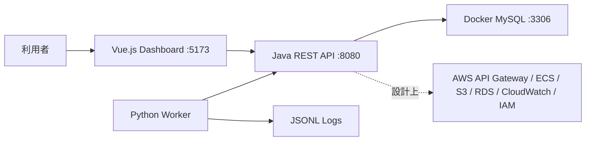
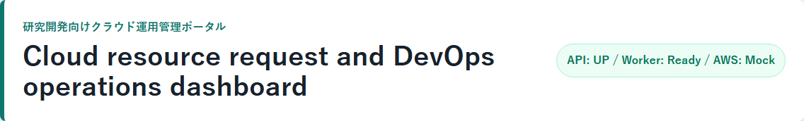
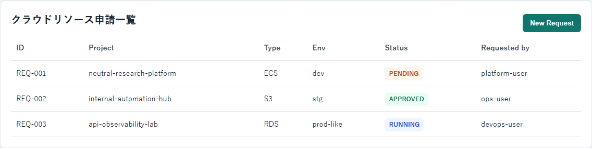
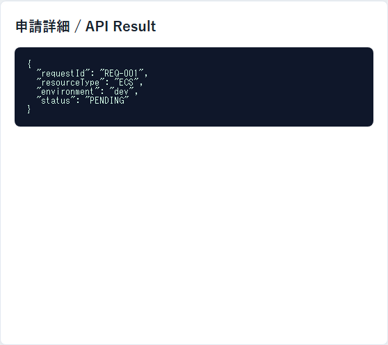
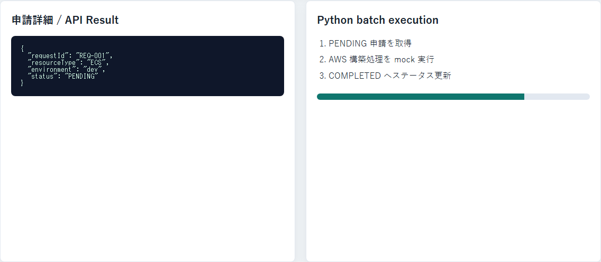
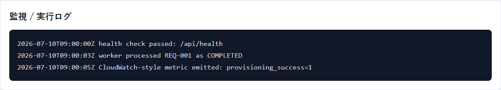

# ES260523874-cloud-ops-portfolio

研究開発向けクラウド運用管理ポータルを題材にした GitHub portfolio project です。AWS クラウド設計、Java REST API、Python 自動化 worker、Docker MySQL、Vue.js dashboard、Docker、Shell、Git / DevOps、Jira / Confluence 風ドキュメント、基本設計からテストまでの流れを一つのリポジトリで確認できるようにしています。

実在する会社名、顧客名、機関名、実業務名、credential、機密情報は含みません。AWS 関連機能は local mock、設定ファイル、設計ドキュメント、Terraform 例で表現しています。

## 対応 job 技術スタック

案件に明示された技術: Java、Python、AWS、Git、Shell、Docker、RESTful API、Jira、Confluence、DevOps 環境設計、後端開発、基本設計、詳細設計、実装、テスト、設計書作成、仕様設計図作成、需求具体化。

ポートフォリオ完成度のために追加した技術: Vue.js、Vite、JDK 標準 HttpServer、Playwright、GitHub Actions、Terraform、Web Dashboard。これらは原案件で明示指定されたものではなく、動作確認・CI・設計説明・スクリーンショット作成を補うために追加しています。

## システム架構図



## ディレクトリ構造

```text
backend-java/      Java REST API
worker-python/     Python automation worker
infra/mysql/        MySQL init SQL
web-dashboard/     Vue.js dashboard source
scripts/           setup / run / test / screenshot scripts
docs/              architecture and project documents
infra/             AWS mock config and Terraform notes
screenshots/       README images
data/              neutral mock request data
```

## ローカル実行

依存関係を準備します。

```bash
cp .env.example .env
bash scripts/setup.sh
```

Vue.js frontend は固定ポート `5173` で起動します。

```bash
bash scripts/run-frontend.sh
```

ブラウザで `http://127.0.0.1:5173` を開きます。

Java/JDK がある環境では API も別 terminal で起動できます。

```bash
bash scripts/run-local.sh
```

API は `GET http://localhost:8080/api/health` で確認します。Java/JDK がない環境では Docker または GitHub Actions で Java 側を検証してください。

## Docker 実行

起動:

```bash
bash scripts/run-docker.sh
```

停止:

```bash
docker compose down
```

Vue.js dashboard、Java API、Python worker、MySQL が Docker Compose で起動します。起動後、ブラウザで `http://127.0.0.1:5173` を開きます。MySQL の初期 schema と seed data は `infra/mysql/init.sql` で投入されます。

## テスト

```bash
bash scripts/test.sh
```

Python worker は pytest、Vue.js dashboard は production build、Java service は JDK がある場合に `javac` と `java` で確認します。GitHub Actions では Temurin 21 を使って Java 側も実行します。

## 主要機能

- Vue.js Dashboard: 申請件数、API 状態、worker 状態、ログを表示。
- Cloud resource request API: MySQL に保存された申請一覧、詳細、作成、ステータス更新。
- Python automation: PENDING 申請を取得し、AWS 構築処理を mock 実行。
- AWS design: API Gateway、ECS、S3、RDS、CloudWatch、IAM の設計方針を文書化。
- DevOps: Docker Compose、Shell script、GitHub Actions、branch strategy。

## 技術選型理由

Java API は backend 開発と RESTful API 設計を示すために採用しました。Python worker は自動化・batch 処理を示すために分離しています。MySQL は Docker 上の永続化 DB として採用し、申請データが API / worker 間で共有される状態を示します。Vue.js は dashboard を local port で起動できる frontend として示すために追加しました。Docker Compose は複数 component の起動確認、Terraform は AWS 設計方針の説明、Playwright は README に貼る実行画面を再生成するために使います。

## セキュリティ考慮

- AWS credential、secret、個人情報、実組織名は配置しない。
- `.env.example` のみ管理し、`.env` は `.gitignore` に入れる。
- IAM は最小権限を前提にし、API / worker / log access の role を分離する。
- worker log は requestId、resourceType、environment など運用に必要な項目だけに限定する。
- 本番化する場合は Cognito / OIDC、JWT、監査ログ、入力 validation、rate limit を追加する。

## 運用スクリーンショット

`npm run screenshots` または `bash scripts/generate-screenshots.sh` で Vite dev server を `http://127.0.0.1:5173` に起動し、以下の PNG を生成します。







## Git / DevOps 方針

- `main`: 安定版。
- `develop`: 結合確認用。
- `feature/*`: ticket 単位の作業 branch。
- Pull Request で CI を通してから merge する。

GitHub Actions はポートフォリオとして DevOps 設計を見せるために追加した内容です。

## 今後の拡張

- Vue.js dashboard から Java API を実際に呼び出す。
- OpenAPI 定義と API contract test。
- MySQL migration tool の導入と schema version 管理。
- LocalStack による S3 / SQS / CloudWatch mock。
- JWT 認証と role-based access control。
- Terraform module 化と環境別 tfvars 設計。

## 関連ドキュメント

- [アーキテクチャ設計](docs/architecture.md)
- [詳細設計](docs/technical-design.md)
- [プロジェクト構造](docs/project-structure.md)
- [セットアップ](docs/setup.md)
- [Jira 風 ticket](docs/jira-sample-tickets.md)
- [Confluence 風設計ノート](docs/confluence-design-note.md)
