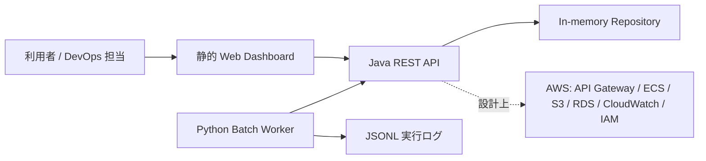

# アーキテクチャ設計

## システム構造図

## コンポーネント説明

- Web Dashboard: API 状態、申請一覧、batch 実行、監視ログを見せる画面。
- Java REST API: `/api/health` と `/api/requests` を提供する主要業務 API。
- Python Batch Worker: PENDING 申請を読み取り、AWS 構築処理を mock 実行する。
- Repository: ローカル起動を軽くするため in-memory とし、RDS は設計上の拡張先とする。
- AWS mock config: 実 credential なしで AWS 設計方針を確認するための設定。

## データ流

1. 利用者が申請を作成または確認する。
2. Java API が申請データを保持する。
3. Python worker が PENDING 申請を取得する。
4. worker が mock 構築ログを出力し、API 経由でステータスを更新する。
5. Dashboard と README 用スクリーンショットが運用状態を可視化する。

## API 流向

- `GET /api/health`: API 稼働確認。
- `GET /api/requests`: 申請一覧取得。
- `GET /api/requests/{id}`: 申請詳細取得。
- `POST /api/requests`: 申請作成。
- `PUT /api/requests/{id}/status`: batch 結果の反映。

## AWS 設計方針

ローカル環境では AWS へ接続しない。設計上は API Gateway を入口にし、ECS で Java API と Python worker を実行、RDS で申請データを保持、S3 でログと設計成果物を保管、CloudWatch でメトリクスとログ監視、IAM で最小権限を適用する。

## DevOps 環境設計方針

GitHub Actions で Python test、Java compile/test、スクリーンショット生成を実行する。Docker Compose は Java API と Python worker の連携確認に使う。ブランチ戦略は `main`、`develop`、`feature/*` を想定する。

## 認証流程

このポートフォリオでは認証を実装していない。理由は、クラウド申請 API と DevOps 設計能力の説明を主目的にし、credential や実ユーザー情報を持たないため。拡張時は Cognito、OIDC、JWT、API Gateway authorizer を追加し、操作ログと権限ロールを分離する。

